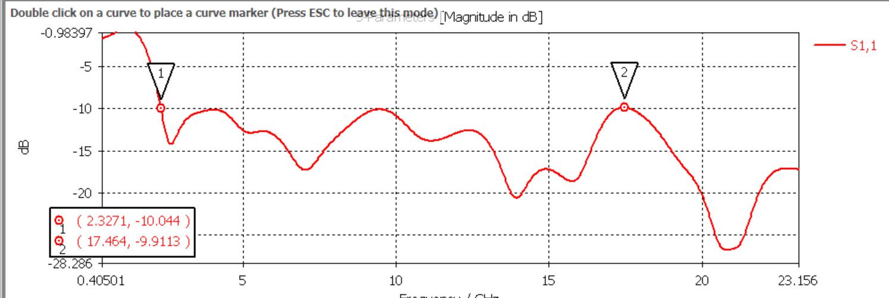
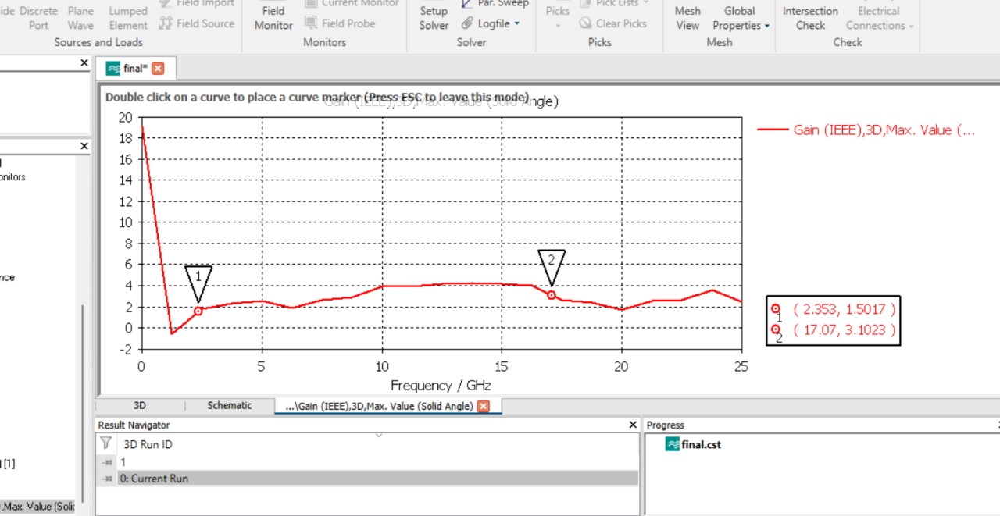

# Wideband Patch Antenna (2.3 GHz - 17 GHz) | CST Project

## Overview
This project involves the design and simulation of a **wideband microstrip patch antenna** operating in the frequency range of **2.3 GHz to 17 GHz**. The design was implemented in **CST Microwave Studio**, and the performance was analyzed based on **S11 (Return Loss), Gain, and Radiation Patterns**.

## Design Specifications
- **Substrate:** Rogers 5880 (lossy)
- **Dielectric Constant (εr):** 2.2
- **Operating Frequency Range:** 2.3 GHz - 17 GHz
- **Patch Shape:** Circular / Rectangular (Specify your design)
- **Feed Type:** Coaxial Probe / Microstrip Line
- **Simulation Tool:** CST Microwave Studio

## Simulation Results
### 1. Patch Antenna Design
Below is the designed patch antenna structure in CST:

### 2. S11 (Return Loss) vs Frequency Graph
The **S11 parameter** indicates how much power is reflected back. A return loss below **-10 dB** indicates good impedance matching.

### 3. Gain vs Frequency Graph
The **gain variation over frequency** provides insights into the antenna's efficiency.

## Key Observations
- The antenna achieves a **wideband operation from 2.3 GHz to 17 GHz**.
- The **S11 parameter remains below -10 dB** across the frequency range, indicating effective impedance matching.
- The **gain increases with frequency**, ensuring good performance across the band.

## Conclusion
The designed patch antenna successfully covers the required bandwidth with **low return loss and good gain performance**. This design is suitable for **broadband applications**, such as **UWB communication, radar, and satellite systems**.

---

### How to Open the CST File
1. Open **CST Microwave Studio**.
2. Go to **File > Open Project**.
3. Select the provided **.cst** file and run simulations.

For further modifications, adjust **patch dimensions, feed location, or substrate properties** to optimize performance.

---

**Author:** Aneket Burman  
**Software Used:** CST Microwave Studio  
**Date:** March 2025

